# Sistema de Apoio Acadêmico - TCC UFAM

---

# Sumário

- [Resumo](#resumo)
- [Abstract](#abstract)
- [1. Introdução](#1-introdução)
  - [1.1 Objetivos](#11-objetivos)
    - [1.1.1 Objetivo Geral](#111-objetivo-geral)
    - [1.1.2 Objetivos Específicos](#112-objetivos-específicos)
  - [1.2 Metodologia](#12-metodologia)
  - [1.3 Organização do Trabalho](#13-organização-do-trabalho)
- [2. Referencial Teórico](#2-referencial-teórico)
- [3. Trabalhos Relacionados](#3-trabalhos-relacionados)
  - [3.1 Sistema para Gerenciamento e Agendamento de Consultas para Psicólogos e Clientes](#31-sistema-para-gerenciamento-e-agendamento-de-consultas-para-psicólogos-e-clientes)
  - [3.2 SystemPsi: Sistema Gerenciador para Psicólogos em Atuação Remota](#32-systempsi-sistema-gerenciador-para-psicólogos-em-atuação-remota)
  - [3.3 Sistema para Agendamento de Serviços](#33-sistema-para-agendamento-de-serviços)
- [4. Materiais e Métodos](#4-materiais-e-métodos)
  - [4.1 Levantamento de Requisitos](#41-levantamento-de-requisitos)
    - [4.1.1 Requisitos Funcionais (RF)](#411-requisitos-funcionais-rf)
    - [4.1.2 Requisitos Não Funcionais (RNF)](#412-requisitos-não-funcionais-rnf)
  - [4.2 Tecnologias utilizadas](#42-tecnologias-utilizadas)
  - [4.3 Banco de dados](#43-banco-de-dados)
  - [4.4 User stories](#44-user-stories)
- [5. Resultados](#5-resultados)
- [6. Considerações finais](#6-considerações-finais)
- [Referências](#referências)
- [Apêndice](#x-apêndice)

---

# Resumo

A crescente demanda por suporte à saúde mental no ensino superior impulsiona a busca por ferramentas tecnológicas que otimizem a gestão dos atendimentos. Visando aprimorar os serviços psicopedagógicos oferecidos na Universidade Federal do Amazonas (UFAM), este trabalho apresenta o desenvolvimento de um Sistema de Apoio Acadêmico. A plataforma web foi projetada para agregar eficiência, segurança e organização ao processo, servindo como uma evolução aos fluxos de trabalho tradicionais. A solução introduz um portal de agendamento online, onde alunos podem visualizar a disponibilidade da equipe e solicitar horários de forma centralizada. Para os profissionais de apoio, o sistema oferece um painel de gestão que simplifica a administração de atendimentos, além de um módulo de prontuário eletrônico para o registro seguro e sigiloso das sessões, cujos dados são protegidos por criptografia para garantir a máxima confidencialidade. Como funcionalidade de destaque, o sistema permite que observações pontuais, julgadas relevantes pelos profissionais para o ambiente de sala de aula, sejam compartilhadas de forma segura. Cada professor pode visualizar apenas as informações pertinentes aos seus próprios alunos, o que promove uma colaboração mais integrada e com maior privacidade no acompanhamento do estudante. O projeto foi desenvolvido seguindo etapas da engenharia de software, incluindo levantamento de requisitos, modelagem de dados e implementação de uma arquitetura moderna. Como resultado, a plataforma eleva a qualidade do serviço de apoio, proporcionando maior agilidade e confidencialidade, utilizando a criptografia como pilar técnico para a segurança das informações e a privacidade dos estudantes. O sistema estabelece, assim, uma ponte de comunicação ética e eficaz entre os profissionais e o corpo docente, contribuindo para um ambiente acadêmico mais integrado e eficiente.

**Palavras-chave:** apoio psicopedagógico, sistema web, gestão acadêmica, privacidade de dados, engenharia de software.

---

# Abstract

The growing demand for mental health support in higher education drives the search for technological tools that optimize service management. Aiming to enhance the psychopedagogical services offered at the Federal University of Amazonas (UFAM), this work presents the development of an Academic Support System. The web platform is designed to add efficiency, security, and organization to the process, serving as an evolution of traditional workflows. The solution introduces an online scheduling portal where students can view staff availability and request appointments in a centralized manner. For professionals, the system offers a management dashboard that simplifies appointment administration, as well as an electronic patient records module for the secure and confidential logging of sessions, with its data protected by encryption to ensure maximum confidentiality. As a key feature, the system allows specific observations, deemed relevant by professionals for the classroom environment, to be shared securely. Each professor can only view information pertaining to their own students, which promotes a more integrated collaboration with greater privacy in student follow-up. The project was developed following software engineering stages, including requirements elicitation, data modeling, and the implementation of a modern architecture. As a result, the platform elevates the quality of the support service, providing greater agility and confidentiality, using encryption as a technical pillar for information security and student privacy. The system thus establishes an ethical and effective communication bridge between professionals and faculty, contributing to a more integrated and efficient academic environment.

**Keywords:** psychopedagogical support, web system, academic management, data privacy, software engineering.

---

# 1. Introdução

A gestão de serviços de apoio psicopedagógico em universidades como a UFAM demanda ferramentas eficientes. Processos manuais para agendamento, registro e comunicação são frequentemente lentos e apresentam riscos à privacidade dos dados dos estudantes. A tecnologia web oferece uma solução direta para modernizar e proteger esses fluxos de trabalho.

Este trabalho apresenta o desenvolvimento de um Sistema de Apoio Acadêmico, uma plataforma web criada para centralizar e otimizar a gestão dos atendimentos pedagógicos no Instituto de Computação (ICOMP). O sistema automatiza o processo de agendamento de atendimentos, substitui prontuários físicos por um módulo eletrônico com dados protegidos por criptografia e estabelece um canal de comunicação seguro.

O principal diferencial da plataforma é permitir que profissionais compartilhem observações pontuais e não-clínicas com professores específicos, que podem visualizar informações apenas dos seus próprios alunos. Essa funcionalidade promove um acompanhamento integrado do estudante, mantendo a confidencialidade e o controle de acesso à informação.

## 1.1 Objetivos

O projeto é guiado por um objetivo principal e desmembrado em metas específicas.

### 1.1.1 Objetivo Geral

Desenvolver um sistema web seguro e eficiente para automatizar o gerenciamento do serviço de apoio psicopedagógico do ICOMP/UFAM, otimizando agendamentos, prontuários eletrônicos e a comunicação controlada entre profissionais, alunos e professores.

### 1.1.2 Objetivos Específicos

- Levantar os requisitos funcionais e não funcionais do sistema.
- Projetar o banco de dados para o armazenamento seguro das informações.
- Implementar um módulo de agendamento de atendimentos online.
- Desenvolver um módulo de prontuário eletrônico com criptografia de dados.
- Criar um sistema de perfis de acesso com permissões restritas para cada tipo de usuário (aluno, professor, profissional e administrador).
- Validar as funcionalidades da plataforma para garantir que atendam às necessidades dos usuários.

---

## 1.2 Metodologia

A metodologia adotada para o desenvolvimento deste projeto foi baseada em um **modelo de desenvolvimento iterativo e incremental**. Essa abordagem foi escolhida por sua flexibilidade, que permite a construção do software em ciclos (iterações), agregando novas funcionalidades a cada etapa e possibilitando a realização de ajustes com base em validações contínuas.

O processo foi organizado nas seguintes fases sequenciais:

1.  **Pesquisa e Fundamentação Teórica:** A fase inicial consistiu na revisão de literatura para compreender as soluções existentes para a gestão de serviços psicopedagógicos e sistemas de agendamento. Esta etapa incluiu a pesquisa por trabalhos acadêmicos e ferramentas de mercado, cujos resultados são apresentados nos capítulos de Referencial Teórico e Trabalhos Relacionados.

2.  **Levantamento e Análise de Requisitos:** Esta fase focou em definir o que o sistema deveria fazer. Foram realizadas reuniões com a profissional do ICOMP para mapear o fluxo de trabalho atual, identificar as principais dores e necessidades. Como resultado, os requisitos do sistema foram documentados em Requisitos Funcionais (RF) e Não Funcionais (RNF), que são detalhados no Capítulo 4.

3.  **Modelagem e Projeto do Sistema (Design):** Com os requisitos definidos, a próxima etapa foi projetar a arquitetura da solução. Isso incluiu:

    - A **modelagem do banco de dados**, com a criação do Modelo Entidade-Relacionamento (MER) para estruturar como as informações seriam armazenadas.
    - A definição da **arquitetura do software**, separando a lógica em backend, frontend e banco de dados.

4.  **Desenvolvimento Iterativo:** A implementação do código foi dividida em ciclos, focando em entregar módulos funcionais de forma incremental. As principais iterações foram:

    - **Iteração 1: Módulo de Agendamento.** Implementação do calendário público, do formulário de solicitação e do painel de gerenciamento de atendimentos para o profissional.
    - **Iteração 2: Módulo de Prontuários e Perfis.** Desenvolvimento da área logada do profissional para criação de prontuários eletrônicos e da área do aluno para visualização de histórico.
    - **Iteração 3: Módulo de Professores e Administrador.** Criação do sistema de permissões, da visualização restrita para professores e das funcionalidades administrativas.

Essa metodologia estruturada permitiu um desenvolvimento controlado, com entregas de valor contínuas e a mitigação de riscos, assegurando que o projeto avançasse de forma organizada e eficiente.

## 1.3 Organização do Trabalho

Para facilitar a compreensão do desenvolvimento e dos resultados alcançados, este trabalho está estruturado em seis capítulos, organizados da seguinte forma:

- **Capítulo 2 – Referencial Teórico:** Estabelece a base conceitual do projeto. Nele são abordados temas essenciais como a importância da saúde mental no contexto universitário e os princípios de Engenharia de Software utilizados (incluindo Clean Architecture e o padrão SPA).

- **Capítulo 3 – Trabalhos Relacionados:** Apresenta uma análise de soluções acadêmicas e sistemas similares existentes na literatura. Esta seção compara as funcionalidades e tecnologias de outros projetos, identificando lacunas e destacando os diferenciais propostos pelo Sistema de Apoio Acadêmico.

- **Capítulo 4 – Materiais e Métodos:** Detalha a engenharia do projeto. Descreve o processo de levantamento de requisitos funcionais e não funcionais, justifica a escolha da pilha tecnológica (backend em .NET 8 e frontend em Vue.js), apresenta a modelagem do banco de dados e define a estrutura das User Stories que guiaram o desenvolvimento.

- **Capítulo 5 – Resultados:** Demonstra o produto de software finalizado. São apresentadas as principais interfaces e funcionalidades implementadas, evidenciando como a solução atende aos objetivos de agendamento, gestão de prontuários seguros e integração entre os perfis de usuário.

- **Capítulo 6 – Considerações Finais:** Retoma os objetivos iniciais para avaliar o êxito do projeto, discute as contribuições da ferramenta para o ICOMP/UFAM e aponta sugestões de melhorias e trabalhos futuros para a evolução do sistema.

# 2. Referencial Teórico

Este capítulo apresenta a fundamentação teórica necessária para o desenvolvimento do Sistema de Apoio Acadêmico. São abordados os conceitos relacionados à gestão da saúde mental no ambiente universitário, seguidos pelos princípios de Engenharia de Software utilizados, incluindo arquitetura de sistemas, desenvolvimento web moderno e segurança da informação com foco na legislação vigente.

## 2.1 Saúde Mental no Ensino Superior

A saúde mental no contexto universitário tem se tornado um tema de crescente relevância. O ambiente acadêmico, caracterizado por prazos rigorosos, alta carga cognitiva e pressão por desempenho, pode atuar como um estressor significativo. Segundo pesquisas recentes, a incidência de ansiedade e depressão entre universitários tende a ser superior à da população geral, o que demanda das instituições de ensino a criação de mecanismos de suporte eficazes.

A informatização desses serviços de apoio não é apenas uma questão de modernização, mas de acessibilidade e eficácia. Sistemas de gestão clínica permitem um acompanhamento mais próximo, reduzem o estigma associado à busca presencial por informações e garantem a continuidade do tratamento através de um histórico organizado e seguro.

## 2.2 Arquitetura de Software

A arquitetura de software refere-se à estrutura fundamental de um sistema, compreendendo seus componentes, as relações entre eles e os princípios que guiam seu design e evolução. Uma arquitetura bem definida é crucial para a manutenibilidade e escalabilidade do software.

### 2.2.1 Clean Architecture

A Clean Architecture (Arquitetura Limpa), proposta por Robert C. Martin, é um padrão de design de software que visa a separação de preocupações. Seu principal objetivo é tornar o sistema independente de frameworks, banco de dados e interfaces de usuário.

O modelo organiza o software em camadas concêntricas, onde a regra de dependência estabelece que as camadas internas (Domínio e Aplicação) não devem conhecer nada sobre as camadas externas (Interface e Infraestrutura). Isso permite que as regras de negócio permaneçam puras e testáveis, enquanto detalhes técnicos podem ser substituídos com mínimo impacto no núcleo do sistema. Essa abordagem facilita a manutenção a longo prazo e a adaptação a novas tecnologias.

### 2.2.2 Padrão API REST

O estilo arquitetural REST (Representational State Transfer) define um conjunto de restrições para a criação de web services. Em uma API REST, a comunicação entre cliente e servidor ocorre através de requisições HTTP padronizadas, tratando os dados como recursos que podem ser criados, lidos, atualizados ou excluídos (operações CRUD).

A adoção de APIs REST permite o desacoplamento total entre o frontend e o backend. O servidor processa as regras de negócio e retorna dados (geralmente em formato JSON), enquanto o cliente (seja web ou mobile) consome esses dados e os apresenta ao usuário.

## 2.3 Desenvolvimento Web Moderno

O desenvolvimento de aplicações web evoluiu do modelo tradicional de renderização no servidor para abordagens focadas na experiência do usuário e na interatividade.

### 2.3.1 Single Page Applications (SPA)

Uma Single Page Application (SPA) é uma aplicação web que carrega uma única página HTML e atualiza dinamicamente o conteúdo conforme o usuário interage com o sistema, sem a necessidade de recarregar a página inteira a cada ação.

Essa abordagem, viabilizada por frameworks JavaScript modernos como Vue.js, React e Angular, proporciona uma experiência de usuário mais fluida e responsiva, semelhante à de aplicativos desktop nativos. O processamento da interface é transferido para o navegador do cliente, reduzindo a carga no servidor e o tráfego de rede.

## 2.4 Segurança e Proteção de Dados

Com a digitalização de registros médicos e acadêmicos, a segurança da informação torna-se um requisito não funcional crítico, envolvendo a confidencialidade, integridade e disponibilidade dos dados.

### 2.4.1 Criptografia e Hash

A criptografia é a técnica fundamental para garantir a confidencialidade dos dados. Ela consiste em codificar a informação de modo que apenas partes autorizadas, detentoras de uma chave específica, possam decifrá-la.

Para o armazenamento de senhas, utilizam-se funções de hash criptográfico. Diferente da criptografia simétrica ou assimétrica, o hash é uma via de mão única: ele transforma a senha em uma cadeia de caracteres de tamanho fixo impossível de ser revertida para o texto original. Isso garante que, mesmo em caso de vazamento do banco de dados, as senhas dos usuários não sejam expostas.

# 3. Trabalhos Relacionados

Neste capítulo, são apresentados trabalhos acadêmicos e projetos de software que abordam temas correlatos ao deste TCC, como sistemas de agendamento online, gerenciamento de atendimentos pedagógicas e plataformas de apoio ao estudante. A análise destes trabalhos permite identificar funcionalidades consolidadas, tecnologias empregadas e, fundamentalmente, as lacunas que justificam o desenvolvimento da presente proposta.

## 3.1 Sistema para Gerenciamento e Agendamento de Atendimentos para Psicólogos e Clientes

Desenvolvido no âmbito de um Trabalho de Conclusão de Curso no Instituto Federal de Goiás (IFG), este projeto de Souza (2021) propõe uma plataforma web para a gestão de agendamentos de atendimentos pedagógicas. O sistema inclui funcionalidades essenciais como agendamento, registro de anamneses e geração de relatórios, operando com perfis de usuário distintos para o profissional e para o cliente. As tecnologias utilizadas foram PHP, JavaScript, HTML, CSS e MySQL.

A principal relevância deste trabalho reside na sua abordagem direta ao agendamento online no contexto da pedagogia, validando a arquitetura de perfis de usuário (profissional e aluno) que é similar à base do nosso sistema (profissional e aluno). No entanto, sua proposta é focada na relação dual cliente-profissional. O diferencial do nosso projeto se manifesta na introdução de um terceiro perfil, o de professor, e na criação de um ecossistema integrado ao ambiente acadêmico, com um canal de comunicação específico e controlado, funcionalidade não abordada por este trabalho.

**Referência:** SOUZA, Wesley Queiroz de. **Sistema para gerenciamento e agendamento de consultas para Psicólogos e clientes: atendimentos online em meio a pandemia do Covid-19**. 2021. TCC (Bacharelado em Sistemas de Informação) - Instituto Federal de Goiás, Câmpus Jataí. Disponível em: [https://repositorio.ifg.edu.br/handle/prefix/1726](https://repositorio.ifg.edu.br/handle/prefix/1726).

## 3.2 SystemPsi: Sistema Gerenciador para Psicólogos em Atuação Remota

O SystemPsi é uma ferramenta tecnológica apresentada como artigo no Congresso Latino-Americano de Software Livre e Tecnologias Abertas (Latinoware), desenvolvida no Instituto Federal Catarinense (IFC). O sistema foi projetado para auxiliar profissionais em atendimentos remotos, e seu desenvolvimento contou com a validação de um profissional da área para garantir a pertinência das funcionalidades. A pilha de tecnologias inclui PHP e MySQL.

Este trabalho se destaca pela sua metodologia, que enfatiza a importância da validação das funcionalidades junto ao usuário final — o profissional de pedagogia. Essa abordagem reforça a metodologia adotada em nosso projeto, que também se baseia na colaboração direta com a profissional do ICOMP. O SystemPsi, contudo, concentra-se nas necessidades do profissional em um contexto de atuação remota geral. Nossa proposta avança ao especializar a ferramenta para o nicho universitário, atendendo não apenas às necessidades do profissional, mas também às dinâmicas de interação com alunos e professores dentro de uma instituição de ensino.

**Referência:** STEFEN, L. E. et al. **SystemPsi: Sistema Gerenciador para Psicólogos em Atuação Remota**. In: Anais do Congresso Latino-Americano de Software Livre e Tecnologias Abertas, 2022. Disponível em: [https://sol.sbc.org.br/index.php/latinoware/article/view/26074](https://sol.sbc.org.br/index.php/latinoware/article/view/26074).

## 3.3 Sistema para Agendamento de Serviços

Em seu Trabalho de Conclusão de Curso na Universidade Tecnológica Federal do Paraná (UTFPR), Kieras (2019) detalha o desenvolvimento de um sistema genérico para o agendamento de serviços, composto por uma aplicação web e um aplicativo móvel.

A principal contribuição deste trabalho para o nosso projeto não está no domínio da aplicação, mas sim na sua sólida documentação de engenharia de software. O detalhamento da análise de requisitos, dos casos de uso e do planejamento das funcionalidades serve como uma excelente referência metodológica para a estruturação do presente TCC. Enquanto o sistema da UTFPR foi projetado para ser genérico e aplicável a diversos contextos de agendamento, nosso sistema se aprofunda em um domínio específico — o apoio psicopedagógico universitário. Essa especialização permite a criação de funcionalidades sob medida, como o prontuário eletrônico e a visualização restrita para professores, que não fariam parte de uma solução genérica.

**Referência:** KIERAS, Ramon Wolski. **Sistema para Agendamento de Serviços**. 2019. TCC (Curso Superior de Tecnologia em Análise e Desenvolvimento de Sistemas) - Universidade Tecnológica Federal do Paraná, Campo Mourão. Disponível em: [http://repositorio.utfpr.edu.br/jspui/bitstream/1/16826/1/PG_COADS_2019_1_02.pdf](http://repositorio.utfpr.edu.br/jspui/bitstream/1/16826/1/PG_COADS_2019_1_02.pdf).

---

# 4. Materiais e Métodos

Este capítulo detalha os materiais, as ferramentas e os procedimentos metodológicos empregados no desenvolvimento do Sistema de Apoio Acadêmico. Serão abordados o processo de levantamento de requisitos, as tecnologias selecionadas para a implementação e a modelagem do banco de dados que estrutura a aplicação.

## 4.1 Levantamento de Requisitos

A etapa de levantamento de requisitos foi fundamental para definir o escopo e as funcionalidades do sistema. O processo foi conduzido através de reuniões com a profissional do ICOMP, a principal interessada (stakeholder) no projeto, e com a orientação da professora Dra. Ana Carolina Oran. Nessas reuniões, foi possível mapear o fluxo de trabalho existente, identificar as limitações do método atual e especificar as necessidades dos futuros usuários (alunos, professores e a própria profissional).

As funcionalidades desejadas foram então estruturadas e classificadas em duas categorias principais, conforme a prática da Engenharia de Software: Requisitos Funcionais e Requisitos Não Funcionais.

### 4.1.1 Requisitos Funcionais (RF)

Os Requisitos Funcionais descrevem as ações e funcionalidades que o sistema deve ser capaz de executar. Eles definem o comportamento do software sob a perspectiva do usuário. A Tabela 1 apresenta a lista de requisitos funcionais identificados para o projeto.

**Tabela 1 – Requisitos Funcionais do Sistema**

| ID    | Categoria                    | Descrição                                                                                                |
| :---- | :--------------------------- | :------------------------------------------------------------------------------------------------------- |
| RF001 | Autenticação                 | O sistema deve permitir login de usuários com email institucional e senha.                               |
| RF002 | Agendamento Público          | Qualquer usuário deve poder acessar a página pública de agendamento de atendimentos.                     |
| RF003 | Agendamento Público          | O sistema deve exibir a disponibilidade dos profissionais em formato de calendário.                      |
| RF004 | Agendamento Público          | O sistema deve permitir a solicitação de agendamento informando dados do estudante e motivo da visita.   |
| RF005 | Notificações                 | O sistema deve enviar email de confirmação quando uma solicitação for recebida.                          |
| RF006 | Notificações                 | O sistema deve enviar email quando um agendamento for confirmado pelo profissional.                      |
| RF007 | Notificações                 | O sistema deve enviar email quando um agendamento for cancelado.                                         |
| RF008 | Notificações                 | O sistema deve enviar email quando um agendamento for remarcado.                                         |
| RF009 | Gerenciamento (Profissional) | O profissional deve poder visualizar e gerenciar solicitações de agendamento.                            |
| RF010 | Gerenciamento (Profissional) | O profissional deve poder confirmar, cancelar ou remarcar agendamentos.                                  |
| RF011 | Gerenciamento (Profissional) | O profissional deve poder configurar sua disponibilidade de horários.                                    |
| RF012 | Gerenciamento (Profissional) | O profissional deve poder iniciar uma sessão a partir de um agendamento confirmado.                      |
| RF013 | Sessões                      | O profissional deve poder registrar anotações da sessão em prontuário eletrônico criptografado.          |
| RF014 | Sessões                      | O profissional deve poder finalizar sessões e marcar o agendamento como concluído.                       |
| RF015 | Sessões                      | O sistema deve registrar automaticamente data/hora de início e término das sessões.                      |
| RF016 | Tipos de Sessão              | O sistema deve permitir cadastro de tipos de sessão com nome, duração e descrição.                       |
| RF017 | Observações                  | O profissional deve poder cadastrar observações sobre estudantes.                                        |
| RF018 | Observações                  | O profissional deve poder categorizar observações por tipo.                                              |
| RF019 | Área do Professor            | Professores devem poder visualizar disciplinas que lecionam organizadas por semestre.                    |
| RF020 | Área do Professor            | Professores devem poder visualizar alunos matriculados em suas disciplinas.                              |
| RF021 | Área do Professor            | Professores devem poder visualizar observações dos profissionais sobre seus alunos.                      |
| RF022 | Administração                | O administrador deve poder gerenciar usuários do sistema (criar, editar, ativar/desativar).              |
| RF023 | Administração                | O administrador /ou profissional deve poder gerenciar semestres letivos.                                 |
| RF024 | Administração                | O administrador /ou profissional deve poder gerenciar disciplinas.                                       |
| RF025 | Administração                | O administrador /ou profissional deve poder vincular professores a disciplinas em semestres específicos. |
| RF026 | Administração                | O administrador /ou profissional deve poder matricular alunos em turmas.                                 |
| RF027 | Administração                | O administrador /ou profissional deve poder gerenciar tipos de observações disponíveis no sistema.       |
| RF028 | Controle de Acesso           | O sistema deve implementar perfis de usuário: Admin, Profissional, Estudante, Assistente e Professor.    |
| RF029 | Controle de Acesso           | O sistema deve restringir acesso a funcionalidades baseado no perfil do usuário.                         |

### 4.1.2 Requisitos Não Funcionais (RNF)

Os Requisitos Não Funcionais especificam os critérios de qualidade e as restrições operacionais do sistema. Eles não se referem a uma funcionalidade específica, mas sim a como o sistema deve operar em termos de desempenho, segurança, usabilidade, entre outros. A Tabela 2 detalha os requisitos não funcionais do projeto.

**Tabela 2 – Requisitos Não Funcionais do Sistema**

| ID     | Categoria           | Descrição                                                                                                                    |
| :----- | :------------------ | :--------------------------------------------------------------------------------------------------------------------------- |
| RNF001 | Tecnologia          | O sistema deve ser uma aplicação web acessível através de navegadores modernos (Chrome, Firefox, Safari, Edge).              |
| RNF002 | Arquitetura         | O backend deve seguir arquitetura limpa (Clean Architecture) com separação em camadas (Domain, Application, Infrastructure). |
| RNF003 | Tecnologia          | O sistema deve utilizar .NET 8 para o backend e Vue.js 3 para o frontend.                                                    |
| RNF004 | Banco de Dados      | O sistema deve utilizar PostgreSQL como sistema gerenciador de banco de dados.                                               |
| RNF005 | Usabilidade         | A interface da tela de solicitaçao deve ser responsiva e adaptável a dispositivos móveis, tablets e desktops.                |
| RNF006 | Segurança           | O acesso ao sistema deve ser controlado por autenticação JWT (JSON Web Token).                                               |
| RNF007 | Segurança           | As senhas dos usuários devem ser armazenadas utilizando hash.                                                                |
| RNF008 | Segurança           | Os prontuários eletrônicos devem ser armazenados de forma criptografada no banco de dados.                                   |
| RNF009 | Segurança           | O acesso aos dados de alunos deve ser restrito apenas aos profissionais autorizados.                                      |
| RNF010 | Segurança           | Professores devem visualizar apenas observações de estudantes matriculados em suas disciplinas.                              |
| RNF011 | Internacionalização | O sistema deve oferecer suporte a múltiplos idiomas (Português, Inglês, Espanhol).                                           |
| RNF012 | Confiabilidade      | O sistema de envio de emails deve utilizar fila assíncrona para garantir entrega.                                            |
| RNF013 | Confiabilidade      | O sistema de emails deve implementar retry automático em caso de falhas temporárias.                                         |
| RNF014 | Usabilidade         | Todas as notificações por email devem ser enviadas em português brasileiro.                                                  |
| RNF015 | Usabilidade         | As datas e horários devem ser exibidas no fuso horário de Manaus (UTC-4).                                                    |
| RNF016 | Desempenho          | O sistema deve utilizar índices de banco de dados para otimizar atendimentos frequentes.                                        |
| RNF017 | Manutenibilidade    | O código deve seguir padrões de nomenclatura e boas práticas de desenvolvimento.                                             |
| RNF018 | Manutenibilidade    | Tipos de sessão e observações devem ser gerenciáveis sem alteração de código.                                                |
| RNF019 | Acessibilidade      | A interface deve seguir princípios básicos de acessibilidade (contraste, navegação por teclado).                             |
| RNF020 | Portabilidade       | O sistema deve ser containerizável usando Docker para facilitar implantação.                                                 |

## 4.2 Tecnologias utilizadas

A escolha das tecnologias para o desenvolvimento do Sistema de Apoio Acadêmico foi guiada por critérios de modernidade, robustez, escalabilidade e conformidade com as melhores práticas de engenharia de software. O sistema foi construído seguindo uma arquitetura cliente-servidor, com clara separação entre o frontend (interface do usuário) e o backend (lógica de negócio e acesso a dados).

### 4.2.1 Backend

O backend do sistema foi desenvolvido utilizando a plataforma **.NET 8**, a versão mais recente (Long-Term Support) do framework da Microsoft para desenvolvimento de aplicações multiplataforma. A escolha do .NET se justifica por sua performance, segurança, ampla documentação e suporte da comunidade.

A estrutura do backend foi organizada seguindo os princípios da **Clean Architecture** (Arquitetura Limpa), proposta por Robert C. Martin. Esta abordagem promove a separação de responsabilidades através de camadas bem definidas:

- **IcompCare.Domain**: Camada de domínio que contém as entidades do negócio, enums e interfaces de repositórios. Esta camada é independente de frameworks externos e representa o núcleo da aplicação.
- **IcompCare.Application**: Camada de aplicação que implementa os casos de uso do sistema através de serviços. Contém as DTOs (Data Transfer Objects) e as interfaces dos serviços.
- **IcompCare.Infrastructure**: Camada de infraestrutura que implementa os detalhes técnicos, como acesso ao banco de dados através do Entity Framework Core, serviços de email e criptografia.
- **IcompCare.Api**: Camada de apresentação que expõe os endpoints REST através de controllers, implementa middlewares de autenticação e tratamento de erros.

As principais bibliotecas e pacotes utilizados no backend incluem:

- **Entity Framework Core 8.0.11**: ORM (Object-Relational Mapper) para mapeamento objeto-relacional e acesso ao banco de dados.
- **Npgsql.EntityFrameworkCore.PostgreSQL 8.0.11**: Provider do Entity Framework para PostgreSQL.
- **Microsoft.AspNetCore.Authentication.JwtBearer 8.0.2**: Implementação de autenticação via tokens JWT.
- **EFCore.NamingConventions 8.0.3**: Conversão automática de nomenclatura para snake_case no banco de dados.
- **System.Net.Mail**: Biblioteca nativa do .NET para envio de emails via SMTP.

### 4.2.2 Frontend

O frontend foi desenvolvido como uma **Single Page Application (SPA)** utilizando **Vue.js 3.5.22**, um framework JavaScript progressivo e reativo. O Vue.js foi escolhido por sua curva de aprendizado suave, excelente performance e ecossistema maduro de ferramentas.

A aplicação frontend utiliza **TypeScript 5.9.3** como linguagem principal, trazendo tipagem estática ao JavaScript e melhorando a manutenibilidade e robustez do código. O gerenciamento de rotas é feito através do **Vue Router 4.6.3**, permitindo navegação client-side e controle de acesso baseado em permissões.

Para a estilização da interface, foi adotado o **Tailwind CSS 4.1.17**, um framework CSS utility-first que permite a construção rápida de interfaces responsivas e consistentes. O projeto utiliza o **Vite 7.1.11** como build tool e dev server, proporcionando hot module replacement (HMR) extremamente rápido durante o desenvolvimento.

As principais bibliotecas complementares do frontend incluem:

- **vue-i18n 11.2.1**: Sistema de internacionalização para suporte a múltiplos idiomas (português, inglês e espanhol).
- **vue-toastification 2.0.0-rc.5**: Biblioteca para exibição de notificações toast ao usuário.
- **lucide-vue-next 0.554.0**: Conjunto de ícones SVG otimizados e personalizáveis.
- **@vueup/vue-quill 1.0.0-beta.11**: Editor de texto rico (WYSIWYG) para criação de prontuários e observações.

### 4.2.3 Banco de Dados

O **PostgreSQL 17** foi escolhido como sistema gerenciador de banco de dados relacional. O PostgreSQL é um SGBD open-source robusto, conhecido por sua confiabilidade, conformidade com padrões SQL e recursos avançados como suporte nativo a tipos JSON, índices complexos e criptografia.

A escolha do PostgreSQL também se alinha com o requisito de segurança e conformidade, uma vez que oferece recursos nativos de criptografia de dados em repouso e em trânsito, além de controle granular de permissões de acesso.

### 4.2.4 Ferramentas de Desenvolvimento

O desenvolvimento do projeto contou com o apoio de diversas ferramentas modernas:

- **Git**: Sistema de controle de versão distribuído para rastreamento de mudanças no código.
- **Docker**: Plataforma de containerização utilizada para facilitar a implantação e garantir consistência entre ambientes de desenvolvimento e produção.
- **ESLint e Prettier**: Ferramentas de linting e formatação de código para manter a qualidade e consistência do código TypeScript/JavaScript.
- **Swagger/OpenAPI**: Documentação automática da API REST, facilitando o consumo dos endpoints pelo frontend.

Esta pilha tecnológica moderna e bem estabelecida no mercado garante que o sistema seja mantível, escalável e alinhado com as melhores práticas da indústria de desenvolvimento de software.

## 4.3 Banco de Dados

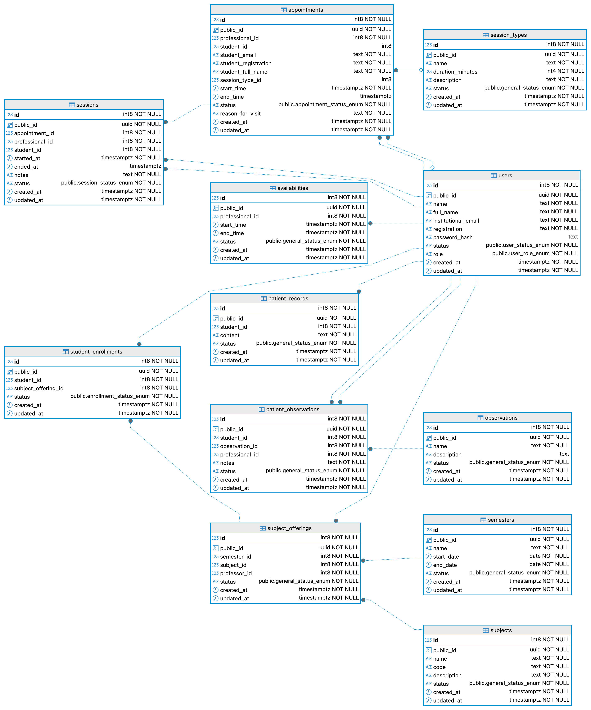

A modelagem do banco de dados é um dos pilares fundamentais do sistema, pois define como as informações são estruturadas, armazenadas e relacionadas. O banco de dados foi projetado seguindo os princípios de normalização, garantindo a integridade referencial e minimizando redundâncias.

### 4.3.1 Modelo Entidade-Relacionamento

O sistema foi modelado utilizando o PostgreSQL como SGBD, aproveitando seus recursos avançados como tipos de dados customizados (ENUMs), triggers, funções e índices otimizados. A estrutura do banco de dados foi organizada em tabelas que representam as principais entidades do domínio do problema.

**Entidades Principais:**

1. **users (Usuários)**: Armazena todos os usuários do sistema, independente do perfil (Admin, Profissional, Estudante, Assistente, Professor). Contém dados de identificação, credenciais de acesso e status da conta. A coluna `role` define o tipo de perfil através de um ENUM, permitindo controle de acesso granular.

2. **availabilities (Disponibilidades)**: Registra os períodos de disponibilidade configurados pelos profissionais. Cada registro possui horário de início e fim, permitindo que o sistema exiba ao público apenas os horários em que o profissional está disponível para atendimento.

3. **appointments (Agendamentos)**: Representa as solicitações de atendimento. Armazena informações do estudante (mesmo que não cadastrado no sistema), do profissional, horários e status do agendamento. O status é controlado por um ENUM com os valores: `pending` (pendente), `confirmed` (confirmado), `in_session` (em sessão), `cancelled` (cancelado) e `completed` (concluído).

4. **sessions (Sessões)**: Registra as sessões de atendimento efetivamente realizadas. Está vinculada a um agendamento confirmado e armazena horário de início, término e anotações do profissional. As anotações são armazenadas de forma criptografada para garantir sigilo.

5. **session_types (Tipos de Sessão)**: Tabela de configuração que define os tipos de atendimento disponíveis (ex: "Primeiro Atendimento", "Retorno", "Orientação"). Cada tipo possui nome, descrição e duração padrão em minutos.

6. **patient_records (Prontuários)**: Armazena os prontuários eletrônicos dos estudantes. O conteúdo é criptografado, garantindo que apenas profissionais autorizados possam acessar informações sensíveis.

7. **observations (Tipos de Observação)**: Tabela de configuração que categoriza os tipos de observações que podem ser feitas sobre estudantes (ex: "Dificuldade de Concentração", "Necessita Acompanhamento").

8. **patient_observations (Observações de Alunos)**: Registra observações específicas feitas por profissionais sobre estudantes. Estas observações podem ser compartilhadas de forma controlada com professores que lecionam para o estudante em questão.

9. **semesters (Semestres)**: Representa os períodos letivos, com datas de início e fim. Permite organizar ofertas de disciplinas por período acadêmico.

10. **subjects (Disciplinas)**: Cadastro das disciplinas oferecidas pela instituição, contendo código, nome e descrição.

11. **subject_offerings (Ofertas de Disciplinas)**: Vincula disciplinas a semestres e professores, representando uma turma específica sendo oferecida em um período letivo.

12. **student_enrollments (Matrículas)**: Registra as matrículas dos estudantes nas turmas. Esta tabela é crucial para o controle de acesso dos professores às observações, pois um professor só pode visualizar informações de estudantes matriculados em suas turmas.

### 4.3.2 Estratégias de Segurança e Integridade

O banco de dados implementa diversas estratégias para garantir segurança e integridade:

**Integridade Referencial**: Todas as relações entre tabelas são garantidas através de chaves estrangeiras (FOREIGN KEY), impedindo inconsistências como referências a registros inexistentes.

**Identificadores Públicos**: Cada tabela possui dois tipos de identificadores:

- `id`: Chave primária sequencial interna (BIGINT), utilizada para otimização de índices e joins.
- `public_id`: UUID público exposto pela API, impedindo enumeração de registros e aumentando a segurança.

**Tipos Enumerados (ENUMs)**: Status e perfis de usuário são implementados como ENUMs nativos do PostgreSQL (ex: `user_role_enum`, `appointment_status_enum`), garantindo que apenas valores válidos sejam armazenados e facilitando queries.

**Triggers de Atualização**: Um trigger `update_modified_column()` é aplicado a todas as tabelas, atualizando automaticamente o campo `updated_at` sempre que um registro é modificado, permitindo auditoria de alterações.

**Índices Otimizados**: O banco possui índices estratégicos em campos frequentemente utilizados em atendimentos:

- Índices em chaves estrangeiras para otimizar joins
- Índices compostos em `(start_time, end_time)` para atendimentos de disponibilidade e agendamentos
- Índices em campos de busca como `student_id`, `professional_id`, `semester_id`

**Constraints de Validação**: O banco implementa validações a nível de dados:

- CHECK constraints para garantir que datas de término sejam posteriores às datas de início
- CHECK constraints para validar formato de emails (presença de @)
- UNIQUE constraints para prevenir duplicação de dados críticos

**Criptografia**: Embora a criptografia dos prontuários seja implementada na camada de aplicação (antes de persistir no banco), o PostgreSQL oferece suporte adicional para criptografia de dados em repouso através de extensões como pgcrypto, caso necessário no futuro.

Esta modelagem robusta e bem estruturada garante que o sistema seja escalável, mantível e seguro, atendendo aos requisitos funcionais e não funcionais especificados, especialmente no que tange à proteção de dados sensíveis.

## 4.4 User stories

As user stories foram desenvolvidas para detalhar os requisitos funcionais do sistema de forma compreensível para os stakeholders e para orientar o desenvolvimento. Cada user story segue o formato proposto por Cohn (2004), descrevendo uma funcionalidade do ponto de vista do usuário final, com critérios de aceitação bem definidos.

### 4.4.1 User Stories Principais

**US001 - Autenticação no Sistema**

Como um usuário do sistema (profissional ou professor), eu gostaria de fazer login com meu email institucional e senha para acessar as funcionalidades disponíveis para meu perfil.

**Critérios de Aceitação:**

- O sistema deve exibir um formulário de login com campos de email e senha
- Credenciais inválidas devem retornar uma mensagem de erro clara
- Após login bem-sucedido, um token JWT deve ser gerado e armazenado
- O token deve expirar após um período determinado de inatividade
- O usuário deve poder fazer logout, invalidando seu token

---

**US002 - Agendar Atendimento (Visitante)**

Como um visitante não autenticado, eu gostaria de visualizar a disponibilidade dos profissionais e solicitar um agendamento fornecendo meus dados básicos (nome, matrícula, email).

**Critérios de Aceitação:**

- A página pública de agendamento deve estar acessível sem login
- O calendário deve exibir apenas horários com disponibilidade confirmada
- O formulário deve aceitar dados do solicitante e do estudante
- Após submeter, o sistema deve gerar um agendamento com status "pendente"
- Um email de confirmação deve ser enviado imediatamente

---

**US003 - Gerenciar Agendamentos (Profissional)**

Como um profissional, eu gostaria de visualizar todas as solicitações de agendamento pendentes e poder confirmá-las ou cancelá-las.

**Critérios de Aceitação:**

- O painel deve listar agendamentos organizados por status
- Cada agendamento deve exibir: nome do estudante, data/hora solicitada, motivo da visita
- Ao confirmar, um email de confirmação deve ser enviado ao estudante
- Ao cancelar, o profissional deve poder remarcar para outra data
- O sistema deve validar conflitos de horários antes de confirmar

---

**US004 - Iniciar Sessão de Atendimento**

Como um profissional, eu gostaria de iniciar uma sessão a partir de um agendamento confirmado para registrar as anotações do atendimento.

**Critérios de Aceitação:**

- O botão de iniciar sessão deve estar disponível apenas para agendamentos confirmados
- Ao iniciar, a data/hora de início deve ser registrada automaticamente
- O sistema deve impedir que o profissional inicie múltiplas sessões simultaneamente
- Um editor de texto rico deve estar disponível para registrar anotações
- Ao finalizar, a data/hora de término deve ser registrada automaticamente

---

**US005 - Configurar Disponibilidade**

Como um profissional, eu gostaria de definir meus horários de disponibilidade para que os estudantes possam visualizar quando posso atender.

**Critérios de Aceitação:**

- O sistema deve permitir cadastrar períodos de disponibilidade com hora de início e fim
- Deve ser possível configurar múltiplos períodos (ex: segunda a sexta de 8h às 12h)
- Disponibilidades que já possuem agendamentos não devem poder ser removidas
- O calendário público deve refletir as alterações em tempo real
- As disponibilidades devem ser exibidas no fuso horário de Manaus (UTC-4)

---

**US006 - Visualizar Disciplinas e Alunos (Professor)**

Como um professor, eu gostaria de visualizar as disciplinas que leciono neste semestre e os alunos matriculados em cada uma delas.

**Critérios de Aceitação:**

- O painel do professor deve listar disciplinas organizadas por semestre
- Ao clicar em uma disciplina, deve exibir a lista completa de alunos
- O sistema deve permitir visualizar dados básicos de cada aluno (nome, matrícula)
- Os dados devem estar sincronizados com as matrículas registradas no sistema

---

**US007 - Visualizar Observações de Alunos**

Como um professor, eu gostaria de visualizar as observações registradas pelos profissionais sobre meus alunos para acompanhar melhor seu desenvolvimento.

**Critérios de Aceitação:**

- As observações devem estar disponíveis na visualização de detalhes do aluno
- Apenas observações de alunos matriculados nas disciplinas do professor devem ser visíveis
- Cada observação deve exibir: data, tipo, descrição e profissional que a registrou
- O professor não deve ter permissão para editar ou deletar observações
- As observações devem estar categorizadas por tipo

---

**US008 - Gerenciar Usuários (Administrador/Profissional)**

Como um administrador do sistema, eu gostaria de criar, editar e desativar contas de usuários, além de atribuir perfis apropriados.

**Critérios de Aceitação:**

- O painel de administração deve permitir buscar usuários por nome ou email
- Ao criar um novo usuário, uma senha temporária deve ser gerada
- O sistema deve permitir alterar o perfil de um usuário existente
- Usuários desativados não devem conseguir fazer login
- Todas as ações de alteração devem ser registradas com data/hora

---

**US009 - Gerenciar Semestres e Disciplinas (Administrador/Profissional)**

Como um administrador, eu gostaria de cadastrar semestres letivos, disciplinas e vincular professores a disciplinas para estruturar a oferta acadêmica.

**Critérios de Aceitação:**

- O sistema deve permitir criar semestres com datas de início e fim
- Disciplinas devem ter código único, nome e descrição
- A vinculação professor-disciplina-semestre deve estar clara e organizável
- O sistema deve impedir datas inválidas (fim anterior ao início)
- Deve ser possível visualizar histórico de ofertas anteriores

---

**US010 - Notificação de Agendamento Confirmado**

Como um estudante, eu gostaria de receber um email confirmando que meu agendamento foi aceito pelo profissional.

**Critérios de Aceitação:**

- O email deve ser enviado em português brasileiro
- Deve conter: nome do profissional, data/hora confirmada, local/modo de atendimento
- O email deve incluir instruções sobre como preparar-se para a sessão
- O email deve ser enviado dentro de 5 minutos após confirmação
- Deve haver mecanismo de retry caso o envio falhe inicialmente

---

# 5. Resultados

O desenvolvimento do Sistema de Apoio Acadêmico resultou em uma plataforma web funcional, robusta e segura, capaz de atender às demandas de gestão psicopedagógica do ICOMP/UFAM. O sistema integrou com sucesso os três perfis de usuários principais (Profissional, Professor e Aluno) em um ambiente unificado, cumprindo os objetivos específicos propostos no início do trabalho.

A seguir, são apresentados os principais resultados obtidos em termos de funcionalidades implementadas e interfaces desenvolvidas.

## 5.1 Acesso e Segurança

A tela de login serve como porta de entrada para o sistema, implementando autenticação segura via JWT (JSON Web Tokens). O sistema valida as credenciais e direciona o usuário para o painel correspondente ao seu perfil (Administrador, Profissional ou Professor), garantindo que cada usuário acesse apenas as funcionalidades permitidas.

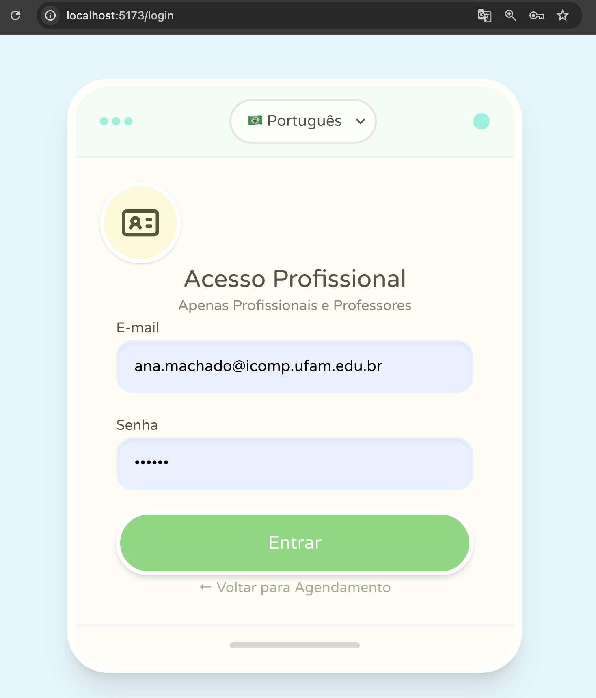

A segurança dos dados foi um resultado crítico alcançado. Todas as senhas são armazenadas com hash criptográfico e, fundamentalmente, os dados sensíveis dos prontuários são criptografados na camada de aplicação antes de serem persistidos no banco de dados. Isso protege a privacidade dos estudantes mesmo em caso de acesso indevido ao banco de dados físico.

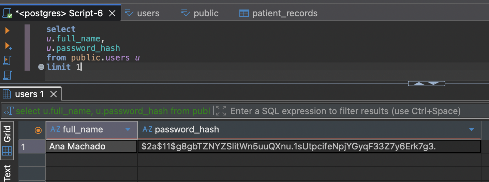

## 5.2 Módulo de Agendamento Público

Para os alunos, foi disponibilizada uma interface pública de agendamento acessível e intuitiva. O calendário exibe em tempo real a disponibilidade dos profissionais, respeitando rigorosamente o fuso horário de Manaus (UTC-4), o que elimina confusões de horário comuns em sistemas web. O formulário de solicitação permite que o aluno informe seus dados e o motivo do atendimento de forma privada.

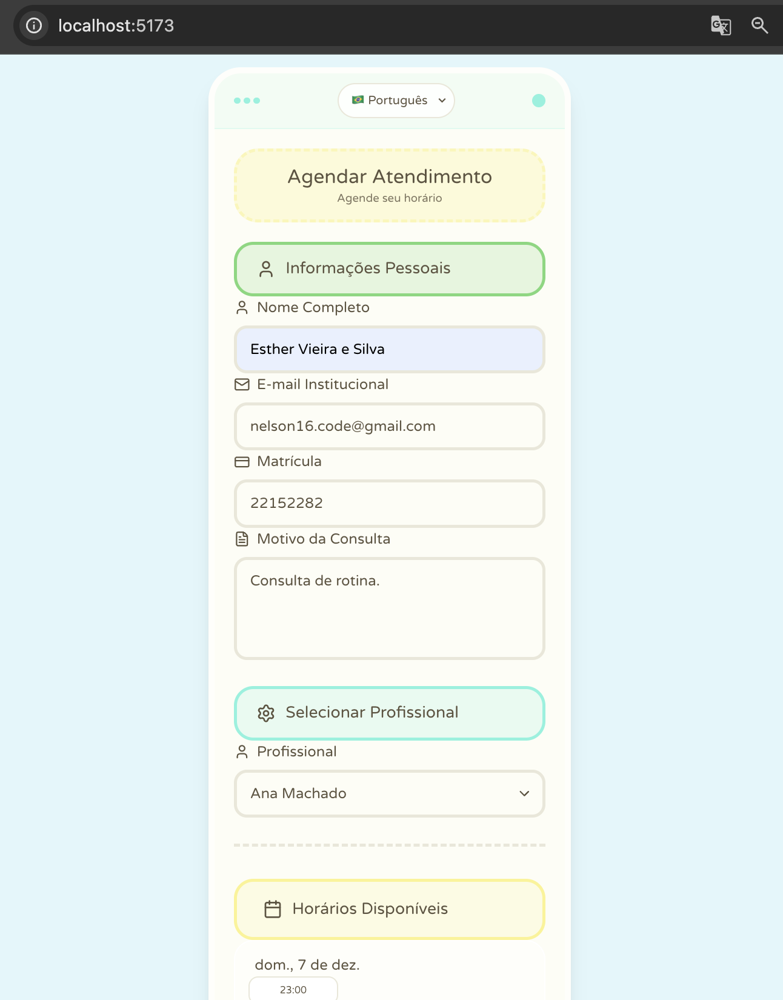

Ao submeter uma solicitação, o sistema dispara automaticamente um email de confirmação de recebimento para o aluno e notifica o profissional, garantindo feedback imediato sobre a ação realizada.

## 5.3 Gestão de Atendimentos (Visão do Profissional)

O painel do profissional centraliza a gestão dos atendimentos de forma eficiente. O profissional pode visualizar solicitações pendentes em uma lista organizada, com opções claras para confirmar, cancelar ou remarcar agendamentos.

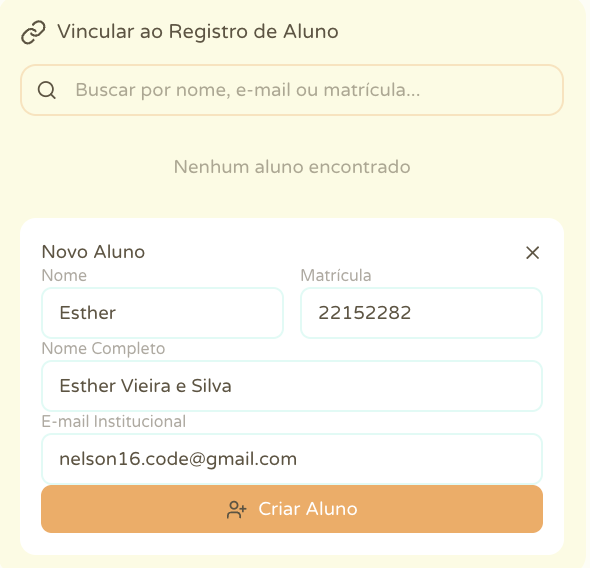
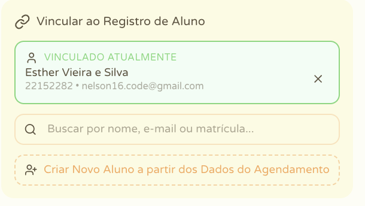
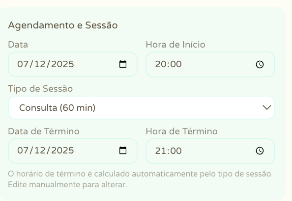

Um dos resultados mais relevantes foi a automação da comunicação transacional. O sistema foi implementado para detectar mudanças de status e enviar notificações automáticas:

- **Confirmação:** O aluno recebe os detalhes finais do agendamento.
- **Cancelamento:** O aluno é avisado imediatamente caso o profissional precise cancelar.
- **Remarcação:** Alterações de data ou hora geram novos avisos para manter o aluno atualizado.

Todos os emails utilizam templates HTML responsivos e em português, reforçando a identidade visual e a clareza da comunicação institucional.

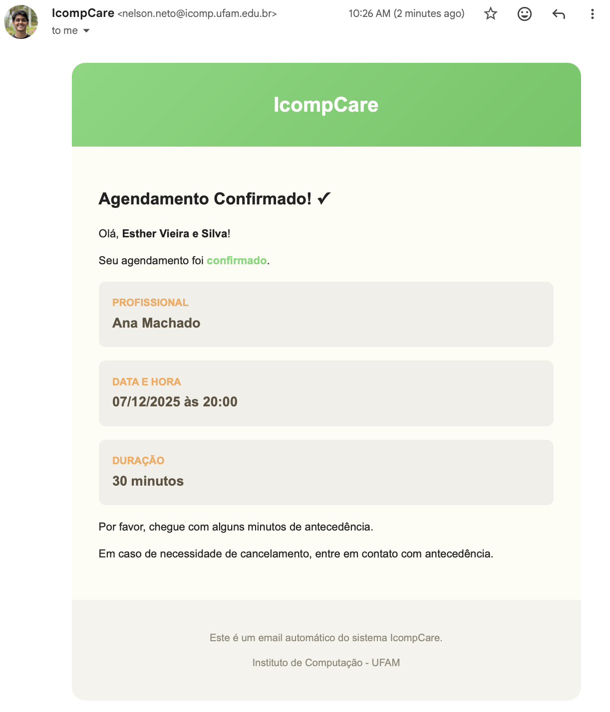

## 5.4 Prontuário Eletrônico e Sessões

O módulo de sessão substitui o uso de prontuários em papel ou arquivos dispersos. O profissional dispõe de um editor de texto rico (Rich Text Editor) para registrar a evolução do aluno e as anotações da sessão. O sistema controla automaticamente o tempo da sessão (início e fim) e garante que as anotações sejam salvas de forma segura e criptografada.

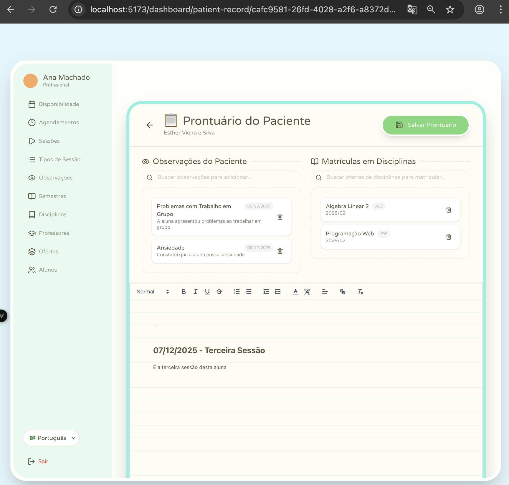

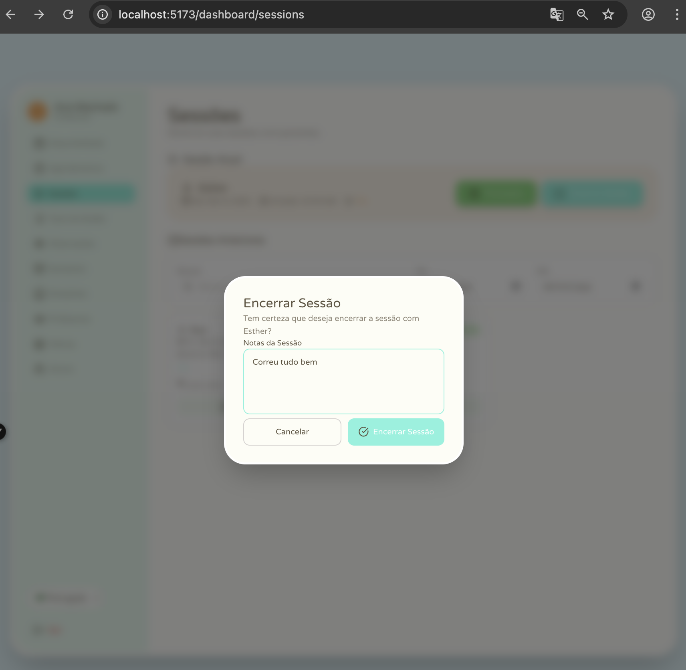

A interface permite também o atendimento rápida ao histórico de atendimentos anteriores do estudante.

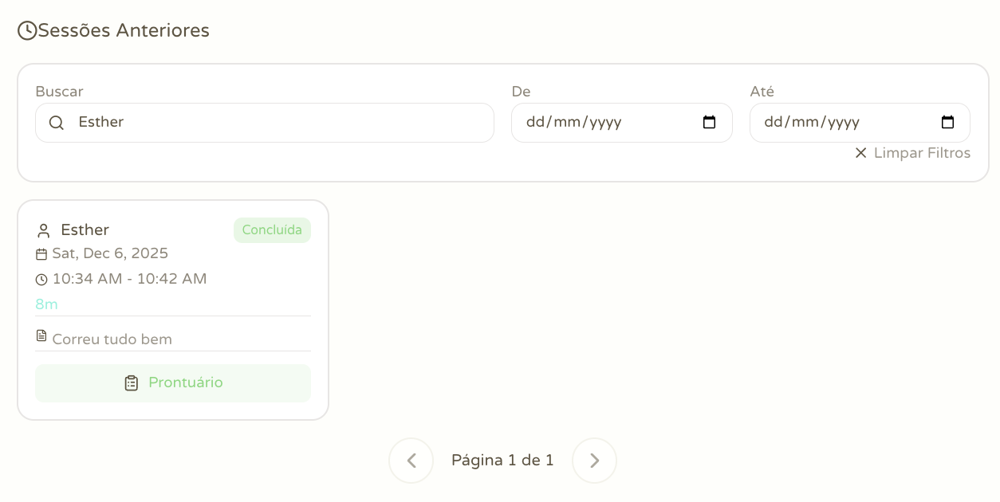
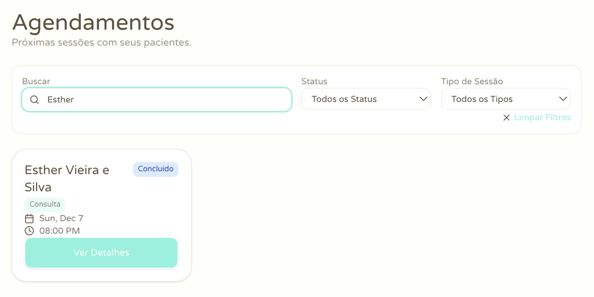

## 5.5 Integração com Docentes

A interface do professor foi desenvolvida para promover a colaboração pedagógica sem ferir o sigilo clínico. O professor visualiza suas turmas organizadas por semestre e a lista de alunos matriculados.

O diferencial implementado foi o sistema de observações compartilhadas: o professor visualiza **apenas** as orientações pedagógicas cadastradas pelo profissional para os alunos de suas turmas específicas. Informações clínicas sensíveis permanecem restritas ao profissional, enquanto orientações práticas (ex: "Aluno necessita de maior tempo para provas") chegam ao professor de forma segura e contextualizada.

## 5.6 Considerações Técnicas

O sistema demonstrou alta performance e estabilidade. A arquitetura em microsserviços (separação API/Frontend) facilitou o desenvolvimento independente e a manutenção. O uso do Docker simplificou o processo de implantação, garantindo que o ambiente de desenvolvimento fosse idêntico ao de produção. A escolha do PostgreSQL e do Entity Framework Core provou-se eficaz para lidar com a complexidade dos relacionamentos entre entidades e a segurança dos dados.

# 6. Considerações finais

Este trabalho alcançou seu objetivo principal ao desenvolver e disponibilizar o Sistema de Apoio Acadêmico para o ICOMP/UFAM. A solução web criada modernizou o fluxo de trabalho do setor psicopedagógico, substituindo processos manuais e descentralizados por uma plataforma unificada, segura e eficiente.

A implementação dos módulos de agendamento, prontuário eletrônico e gestão de perfis atendeu plenamente aos requisitos levantados. A adoção de tecnologias modernas como .NET 8 e Vue.js, aliada a uma arquitetura limpa, garantiu um software de alta qualidade técnica, manutenível e escalável.

Um dos pontos altos do projeto foi a segurança. A utilização de criptografia para dados sensíveis e a segregação rigorosa de acesso às informações asseguram que a privacidade dos estudantes seja preservada, estabelecendo um padrão ético elevado para o tratamento de dados acadêmicos e de saúde.

A integração entre profissionais e professores, mediada pelo sistema de observações compartilhadas, representa um avanço significativo na forma como a instituição pode apoiar seus alunos. A ferramenta permite que informações pedagógicas relevantes circulem de forma segura, potencializando a rede de apoio ao estudante sem comprometer o sigilo clínico.

## 6.1 Trabalhos Futuros

Como sugestão para a continuidade e evolução deste projeto, vislumbram-se as seguintes melhorias:

- **Integração com Sistemas Institucionais:** Implementar integração com o sistema de matrícula da UFAM para importação automática de alunos, disciplinas e turmas, reduzindo a necessidade de cadastro manual.
- **Módulo de Relatórios Gerenciais:** Desenvolver dashboards com indicadores de atendimento (ex: número de atendimentos por mês, principais motivos de procura) para auxiliar na tomada de decisão da coordenação.
- **Notificações via WhatsApp:** Expandir o sistema de notificações para incluir mensagens via WhatsApp, aumentando a taxa de visualização e confirmação dos agendamentos pelos alunos.
- **Chat Seguro:** Implementar um canal de chat em tempo real entre aluno e profissional para triagem inicial ou dúvidas rápidas, mantendo a criptografia ponta a ponta.

Em suma, o Sistema de Apoio Acadêmico entrega valor imediato à comunidade acadêmica do ICOMP, estabelecendo uma base sólida para a gestão do bem-estar estudantil e servindo como modelo para outras unidades da universidade.

# Referências

COHN, Mike. **User Stories Applied: For Agile Software Development**. Addison-Wesley Professional, 2004.

KIERAS, Ramon Wolski. **Sistema para Agendamento de Serviços**. 2019. TCC (Curso Superior de Tecnologia em Análise e Desenvolvimento de Sistemas) - Universidade Tecnológica Federal do Paraná, Campo Mourão. Disponível em: <http://repositorio.utfpr.edu.br/jspui/bitstream/1/16826/1/PG_COADS_2019_1_02.pdf>.

MARTIN, Robert C. **Clean Architecture: A Craftsman's Guide to Software Structure and Design**. Prentice Hall, 2017.

MICROSOFT. **ASP.NET Core Documentation**. Disponível em: <https://learn.microsoft.com/aspnet/core>. Acesso em: 05 dez. 2025.

POSTGRESQL GLOBAL DEVELOPMENT GROUP. **PostgreSQL 17 Documentation**. Disponível em: <https://www.postgresql.org/docs/17/>. Acesso em: 05 dez. 2025.

SOUZA, Wesley Queiroz de. **Sistema para gerenciamento e agendamento de consultas para Psicólogos e clientes: atendimentos online em meio a pandemia do Covid-19**. 2021. TCC (Bacharelado em Sistemas de Informação) - Instituto Federal de Goiás, Câmpus Jataí. Disponível em: <https://repositorio.ifg.edu.br/handle/prefix/1726>.

STEFEN, L. E. et al. **SystemPsi: Sistema Gerenciador para Psicólogos em Atuação Remota**. In: Anais do Congresso Latino-Americano de Software Livre e Tecnologias Abertas, 2022. Disponível em: <https://sol.sbc.org.br/index.php/latinoware/article/view/26074>.

TAILWIND LABS. **Tailwind CSS Documentation**. Disponível em: <https://tailwindcss.com/docs>. Acesso em: 05 dez. 2025.

VUE.JS. **Vue.js Documentation**. Disponível em: <https://vuejs.org/guide/introduction.html>. Acesso em: 05 dez. 2025.
