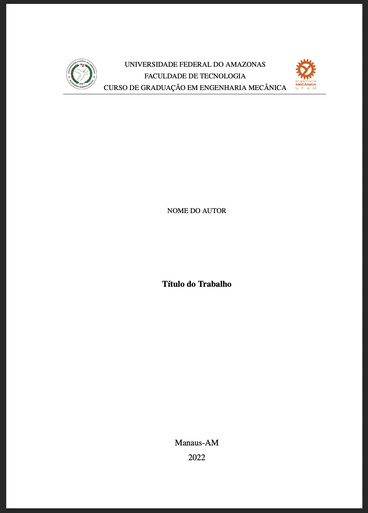
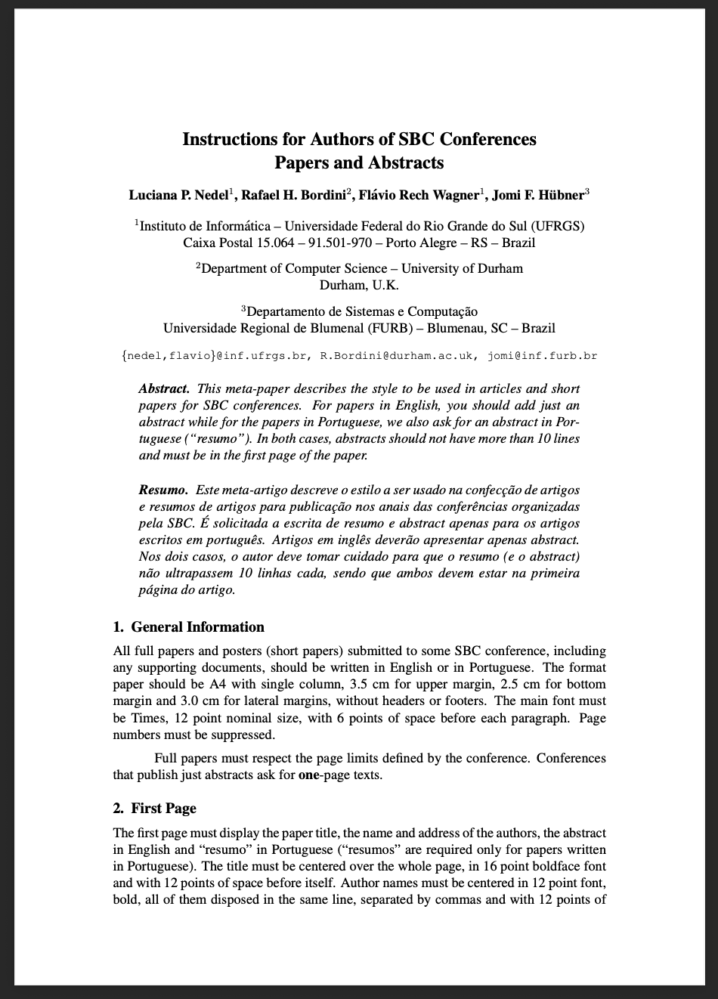

# Sumário / Table of Contents

## Português

- [Modelo de TCC, Dissertação e Tese - Engenharia Mecânica UFAM](#1-modelo-de-tcc-dissertação-e-tese---engenharia-mecânica-ufam)
- [SBC Conferences Template](#2-sbc-conferences-template)

## English

- [UFAM Mechanical Engineering Thesis/Dissertation Template](#ufam-mechanical-engineering-thesisdissertation-template)
- [SBC Conferences Template (English)](#sbc-conferences-template-english)

# Overleaf Template Examples

Este documento apresenta dois exemplos de templates LaTeX disponíveis na pasta `overleaf/examples`.

---

## 1. Modelo de TCC, Dissertação e Tese - Engenharia Mecânica UFAM

Este template é voltado para trabalhos acadêmicos (TCC, dissertação, tese) da Engenharia Mecânica da UFAM.

**Características:**

- Estrutura modular para facilitar organização.
- Suporte à ABNT.
- Pasta dedicada para imagens.
- Arquivo de bibliografia separado.

**Primeira Página:**

---

## 2. SBC Conferences Template

Este template segue o padrão da Sociedade Brasileira de Computação (SBC) para artigos e resumos em conferências.

**Características:**

- Formatação para artigos científicos e resumos.
- Instruções para inclusão de figuras e tabelas.
- Exemplo de estrutura de autores, instituições e emails.
- Suporte a português e inglês.

**Primeira Página:**

---

> Para mais detalhes, consulte os arquivos `.tex` em cada pasta de exemplo.

# Overleaf Template Examples (English Version)

This document presents two examples of LaTeX templates available in the `overleaf/examples` folder of the project.

---

## UFAM Mechanical Engineering Thesis/Dissertation Template

This template is designed for academic works (thesis, dissertation) in Mechanical Engineering at UFAM.

**Features:**

- Modular structure for easy organization.
- ABNT support.
- Dedicated folder for images.
- Separate bibliography file.

**First Page:**

---

## SBC Conferences Template (English)

This template follows the standards of the Brazilian Computer Society (SBC) for conference papers and abstracts.

**Features:**

- Formatting for scientific papers and abstracts.
- Instructions for including figures and tables.
- Example structure for authors, institutions, and emails.
- Support for Portuguese and English.

**First Page:**

---

> For more details, check the `.tex` files in each example folder.
